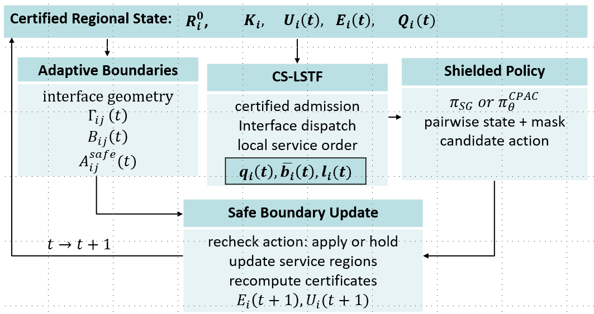

# Certified Multi-Agent Collaboration via Boundary Adaptation

Reference implementation for "Certified Multi-Agent Collaboration via Boundary
Adaptation under Worst-Case Response Constraints".

The code implements certified boundary collaboration for online spatial service.
Agents keep fixed owner regions, may share service eligibility inside bounded
interface bands, and execute boundary updates only after the feasibility kernel
passes. The release includes the deterministic slack-gradient policy pi_SG and
the learned CPAC policy, both operating over the same shielded action set.

## Architecture



## Policies

| Paper symbol | Code slug | Description |
|---|---|---|
| pi_hold | `hold` | no boundary adaptation |
| pi_FB | `fixed_band` | fixed pre-certified band |
| pi_SG | `safe_greedy` | deterministic slack-gradient policy |
| pi_CPAC | `masked_ppo` | masked PPO actor used by CPAC |

`pi_SG` is implemented as `make_safe_greedy_policy` in `scripts/run_experiment.py`.
CPAC training and evaluation use `scripts/train_cpac_phase2.py` and
`scripts/eval_cpac_phase2.py`.

## Repository layout

```text
certified_marl/        library code
  env/                 geometry, arrivals, CS-LSTF, certificates
  shield/              feasibility kernel, contracts, active-interface matching
  metrics/             safety, response tail, imbalance, panel summaries
  models/              actor and critic modules
  objectives/          CPAC reward and reward normalization
  trainers/            masked PPO trainer
  utils/               logging, registry, seeding
configs/experiment/    experiment configurations
scripts/               deterministic policies, run, train/evaluate, aggregate, and plot scripts
tests/                 unit and smoke tests for shielded execution
```

Datasets and run outputs are not committed. Chicago replay inputs are generated
with `scripts/fetch_chicago_data.py`, `scripts/prep_chicago_loop4.py`, and
`scripts/scale_chicago_loop4.py`.

## Install

```bash
pip install -e .
```

## Smoke tests

```bash
python -m pytest tests -q
python scripts/run_experiment.py --configs exp00_g4_c8 \
    --policies hold fixed_band safe_greedy --seeds 0 \
    --output-dir runs/smoke/exp00_g4_c8
python scripts/train_cpac_phase2.py --configs exp00_g4_c8 --seed 0 \
    --num-updates 1 --rollout-length 16 --epochs-per-update 1 \
    --minibatch-size 8 --bc-pretrain-steps 0 --out runs/smoke/cpac --device cpu
python scripts/eval_cpac_phase2.py --checkpoint runs/smoke/cpac/ckpt.pt \
    --config exp00_g4_c8 --seeds 0 --out runs/smoke/cpac_eval --device cpu
```

The smoke path checks imports, shielded deterministic policies, CPAC training,
CPAC evaluation, and runtime feasibility counters.

## Reproducing experiments

See `REPRODUCE.md` for the regime-to-config map and full command templates.
Full paper-scale runs require the complete seed matrix and can take substantially
longer than the smoke tests.

## Data

Regime R uses the City of Chicago Crimes - 2001 to Present open dataset. The fetch script documents the query and writes local
JSON files under `data/`, which is intentionally excluded from the release.

## Citation

See `CITATION.cff`.
